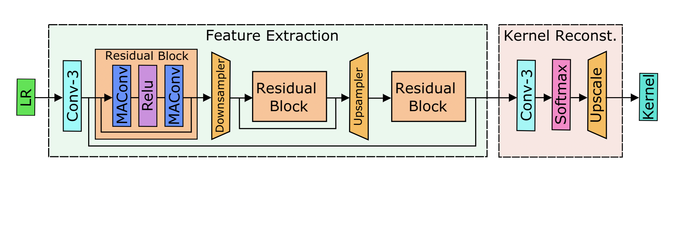
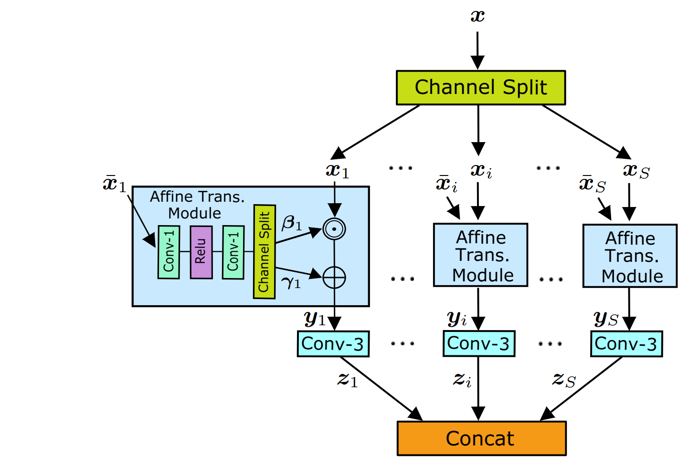

# Mutual Affine Network for Spatially Variant Kernel Estimation in Blind Image Super-Resolution (MANet, ICCV2021)

[](https://arxiv.org/abs/2108.05302)
[](https://github.com/JingyunLiang/MANet)
[](https://github.com/JingyunLiang/MANet/releases)
[ <a href="https://colab.research.google.com/gist/JingyunLiang/4ed2524d6e08343710ee408a4d997e1c/manet-demo-on-spatially-variant-kernel-estimation.ipynb"></a>](https://colab.research.google.com/gist/JingyunLiang/4ed2524d6e08343710ee408a4d997e1c/manet-demo-on-spatially-variant-kernel-estimation.ipynb)


This repository is the official PyTorch implementation of Mutual Affine Network for ***Spatially Variant*** Kernel Estimation in Blind Image Super-Resolution
([arxiv](https://arxiv.org/pdf/2108.05302.pdf), [supplementary](https://github.com/JingyunLiang/MANet/releases)).

 :rocket:  :rocket:  :rocket: **News**:
  - Aug. 7, 2021: We add an [online Colab demo for MANet kernel estimation <a href="https://colab.research.google.com/gist/JingyunLiang/4ed2524d6e08343710ee408a4d997e1c/manet-demo-on-spatially-variant-kernel-estimation.ipynb"></a>](https://colab.research.google.com/gist/JingyunLiang/4ed2524d6e08343710ee408a4d997e1c/manet-demo-on-spatially-variant-kernel-estimation.ipynb)
  - Sep.06, 2021: See our recent work [SwinIR: Transformer-based image restoration](https://github.com/JingyunLiang/SwinIR).[](https://arxiv.org/abs/2108.10257)[](https://github.com/JingyunLiang/SwinIR)[](https://github.com/JingyunLiang/SwinIR/releases)[ <a href="https://colab.research.google.com/gist/JingyunLiang/a5e3e54bc9ef8d7bf594f6fee8208533/swinir-demo-on-real-world-image-sr.ipynb"></a>](https://colab.research.google.com/gist/JingyunLiang/a5e3e54bc9ef8d7bf594f6fee8208533/swinir-demo-on-real-world-image-sr.ipynb)
  - Aug. 17, 2021: See our previous work on [blind SR: Flow-based Kernel Prior with Application to Blind Super-Resolution (FKP), CVPR2021](https://github.com/JingyunLiang/FKP)  [](https://arxiv.org/abs/2103.15977)
[](https://github.com/JingyunLiang/FKP)*
 - Aug. 17, 2021: See our recent work for [generative modelling of image SR: Hierarchical Conditional Flow: A Unified Framework for Image Super-Resolution and Image Rescaling (HCFlow), ICCV2021](https://github.com/JingyunLiang/HCFlow) [](https://arxiv.org/abs/2108.05301)
[](https://github.com/JingyunLiang/HCFlow)[](https://github.com/JingyunLiang/HCFlow/releases)[ <a href="https://colab.research.google.com/gist/JingyunLiang/cdb3fef89ebd174eaa43794accb6f59d/hcflow-demo-on-x8-face-image-sr.ipynb"></a>](https://colab.research.google.com/gist/JingyunLiang/cdb3fef89ebd174eaa43794accb6f59d/hcflow-demo-on-x8-face-image-sr.ipynb)
 - Aug. 17, 2021: See our recent work for [real-world image SR: Designing a Practical Degradation Model for Deep Blind Image Super-Resolution (BSRGAN), ICCV2021](https://github.com/cszn/BSRGAN)  [](https://arxiv.org/abs/2103.14006)
[](https://github.com/cszn/BSRGAN)
 
  ---

> Existing blind image super-resolution (SR) methods mostly assume blur kernels are spatially invariant across the whole image. However, such an assumption is rarely applicable for real images whose blur kernels are usually spatially variant due to factors such as object motion and out-of-focus. Hence, existing blind SR methods would inevitably give rise to poor performance in real applications. To address this issue, this paper proposes a mutual affine network (MANet) for spatially variant kernel estimation. Specifically, MANet has two distinctive features. First, it has a moderate receptive field so as to keep the locality of degradation. Second, it involves a new mutual affine convolution (MAConv) layer that enhances feature expressiveness without increasing receptive field, model size and computation burden. This is made possible through exploiting channel interdependence, which applies each channel split with an affine transformation module whose input are the rest channel splits. Extensive experiments on synthetic and real images show that the proposed MANet not only performs favorably for both spatially variant and invariant kernel estimation, but also leads to state-of-the-art blind SR performance when combined with non-blind SR methods.
><p align="left">
   > 
</p>


## Requirements
- Python 3.7, PyTorch >= 1.6.0, scipy >= 1.6.3 
- Requirements: opencv-python
- Platforms: Ubuntu 16.04, cuda-10.0 & cuDNN v-7.5

Note: this repository is based on [BasicSR](https://github.com/xinntao/BasicSR#memo-codebase-designs-and-conventions). Please refer to their repository for a better understanding of the code framework.


## Quick Run
Download `stage3_MANet+RRDB_x4.pth` from [release](https://github.com/JingyunLiang/MANet/releases) and put it in `./pretrained_models`. Then, run following command. Or you can go to our [online Colab demo for MANet kernel estimation <a href="https://colab.research.google.com/gist/JingyunLiang/4ed2524d6e08343710ee408a4d997e1c/manet-demo-on-spatially-variant-kernel-estimation.ipynb"></a>](https://colab.research.google.com/gist/JingyunLiang/4ed2524d6e08343710ee408a4d997e1c/manet-demo-on-spatially-variant-kernel-estimation.ipynb) to have a try.
```bash
cd codes
python test.py --opt options/test/test_stage3.yml
```
---

## Data Preparation
To prepare data, put training and testing sets in `./datasets` as `./datasets/DIV2K/HR/0801.png`. Commonly used datasets can be downloaded [here](https://github.com/xinntao/BasicSR/blob/master/docs/DatasetPreparation.md#common-image-sr-datasets).


## Training

Step1: to train MANet, run this command:

```bash
python train.py --opt options/train/train_stage1.yml
```

Step2: to train non-blind RRDB, run this command:

```bash
python train.py --opt options/train/train_stage2.yml
```

Step3: to fine-tune RRDB with MANet, run this command:

```bash
python train.py --opt options/train/train_stage3.yml
```

All trained models can be downloaded from [release](https://github.com/JingyunLiang/MANet/releases). For testing, downloading stage3 models is enough.


## Testing

To test MANet (stage1, kernel estimation only), run this command:

```bash
python test.py --opt options/test/test_stage1.yml
```
To test RRDB-SFT (stage2, non-blind SR with ground-truth kernel), run this command:

```bash
python test.py --opt options/test/test_stage2.yml
```
To test MANet+RRDB (stage3, blind SR), run this command:

```bash
python test.py --opt options/test/test_stage3.yml
```
Note: above commands generate LR images on-the-fly. To generate testing sets used in the paper, run this command:
```bash
python prepare_testset.py --opt options/test/prepare_testset.yml
```

## Interactive Exploration of Kernels
To explore spaitally variant kernels on an image, use `--save_kernel` and run this command to save kernel:

```bash
python test.py --opt options/test/test_stage1.yml --save_kernel
```
Then, run this command to creat an interactive window:
```bash
python interactive_explore.py --path ../results/001_MANet_aniso_x4_test_stage1/toy_dataset1/npz/toy1.npz
```

## Results
We conducted experiments on both spatially variant and invariant blind SR. Please refer to the [paper](https://arxiv.org/abs/2108.05302) and [supp](https://github.com/JingyunLiang/MANet/releases) for results. 

## Citation
    @inproceedings{liang2021mutual,
      title={Mutual Affine Network for Spatially Variant Kernel Estimation in Blind Image Super-Resolution},
      author={Liang, Jingyun and Sun, Guolei and Zhang, Kai and Van Gool, Luc and Timofte, Radu},
      booktitle={IEEE International Conference on Computer Vision},
      year={2021}
    }

## License & Acknowledgement

This project is released under the Apache 2.0 license. The codes are based on [BasicSR](https://github.com/xinntao/BasicSR), [MMSR](https://github.com/open-mmlab/mmediting), [IKC](https://github.com/yuanjunchai/IKC) and [KAIR](https://github.com/cszn/KAIR). Please also follow their licenses. Thanks for their great works.


